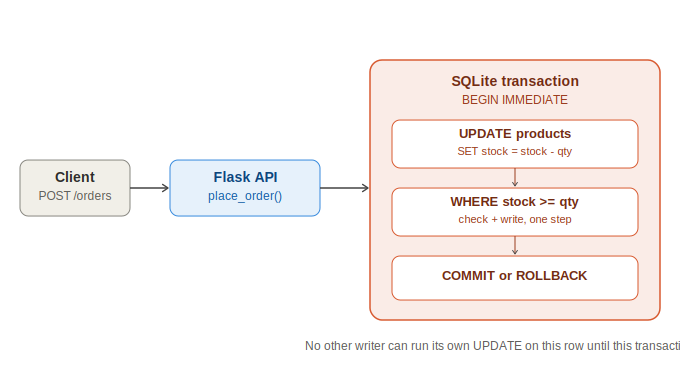
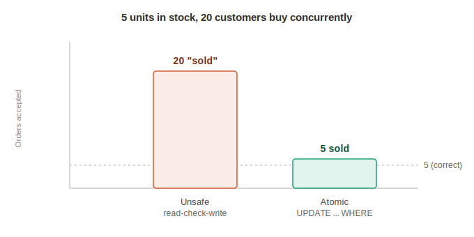

# Mini E-commerce Backend

A Flask + SQLite backend for products and orders, with the classic
"last item in stock" race condition fixed at the database level — and a
script that proves the bug exists without the fix, not just a claim.

## Why this exists

Most beginner e-commerce demos check stock like this:
```python
stock = read_stock(product_id)        # 1. read
if stock >= quantity:                  # 2. check
    write_stock(product_id, stock - quantity)  # 3. write
```
This works fine with one customer. It breaks the moment two customers try to
buy the same low-stock item at the same time: both read the same stock value,
both pass the check, both write — and the product gets oversold.



## The fix: one atomic UPDATE

Instead of read-then-check-then-write as three separate steps, the check and
the decrement happen as a **single SQL statement**:

```sql
UPDATE products
SET stock_quantity = stock_quantity - ?
WHERE id = ? AND stock_quantity >= ?
```

If this statement affects 0 rows, the `WHERE` clause's stock check failed —
there wasn't enough stock — and we know to reject the order. There's no
window between "check" and "write" for another transaction to sneak in,
because there's no separate check step at the application level; the
database does both at once. This is wrapped in a `BEGIN IMMEDIATE`
transaction so a multi-item order is also atomic as a whole: if any single
item in the order fails, every item's stock change in that order is rolled
back, not just the failing one.

### Proof, not just a claim

`tests/concurrency_test.py` simulates 20 customers concurrently trying to buy
a product with only 5 units left, comparing the naive unsafe approach
against this project's atomic approach. Actual output from a real run:



```
Scenario: 5 units in stock, 20 customers buy 1 unit each, concurrently

[UNSAFE read-check-write]  'sold' = 20 of 20 attempts  final_stock = 4
           -> BUG: oversold by 15 units. Lost updates also mean the final_stock
              number itself can't be trusted - concurrent writers overwrote
              each other's decrements instead of stacking them.

[SAFE   atomic UPDATE...WHERE]  sold = 5 of 20 attempts  final_stock = 0  -> CORRECT
```

Notice the unsafe version's `final_stock = 4`, not some obviously-broken
negative number — most of the 20 threads read the same stale `stock = 5` at
the same instant, each independently computed `5 - 1 = 4`, and whichever
write landed last simply overwrote the others. This is a **lost update**,
the same underlying bug as overselling, and it's the more dangerous failure
mode precisely because the resulting number doesn't look obviously wrong.

(The unsafe demo includes a small simulated delay between its read and write
steps, mimicking realistic request processing time such as a fraud check or
payment gateway call. Without it the race window is so narrow on a fast local
machine that the bug doesn't reproduce on every run — which is itself the
point: race conditions like this are not "rare," they're load-dependent, and
the absence of a failure in light testing is not proof of safety.)

## Project structure

```
ecommerce-backend/
├── app/
│   ├── schema.sql      # table definitions, constraints, indexes
│   ├── db.py           # data access layer + place_order() with the fix
│   ├── unsafe_db.py     # naive unsafe version, for the comparison test only
│   └── server.py        # Flask REST API
├── tests/
│   └── concurrency_test.py   # proves the race condition and the fix
├── diagrams/
├── requirements.txt
└── README.md
```

## Running it

```bash
pip install -r requirements.txt
cd app
python3 server.py     # creates store.db on first run, serves on :5001
```

```bash
# Create a product
curl -X POST http://localhost:5001/products \
  -H "Content-Type: application/json" \
  -d '{"name": "Mechanical Keyboard", "price_cents": 4999, "stock_quantity": 3}'

# List products
curl http://localhost:5001/products

# Place an order (one or more items)
curl -X POST http://localhost:5001/orders \
  -H "Content-Type: application/json" \
  -d '{"items": [{"product_id": 1, "quantity": 2}]}'

# Get order details
curl http://localhost:5001/orders/1
```

```bash
# Run the concurrency proof
python3 tests/concurrency_test.py
```

## API

| Endpoint | Method | Notes |
|---|---|---|
| `/health` | GET | Health check |
| `/products` | GET | List all products |
| `/products` | POST | Create a product: `{name, price_cents, stock_quantity}` |
| `/products/<id>` | GET | Get one product |
| `/orders` | POST | Place an order: `{items: [{product_id, quantity}, ...]}` |
| `/orders/<id>` | GET | Get order details, including line items |

Responses use standard status codes:
- `201` created (product/order)
- `400` invalid input (missing/wrong-typed fields)
- `404` product or order not found
- `409` insufficient stock — the conventional code for "the resource's state
  changed under you," distinct from a plain client input error

## Schema design notes

- `order_items.price_at_purchase_cents` stores the price **at the time of
  purchase**, not a live lookup into `products.price_cents`. If product
  prices changed and orders referenced the live price, a past order's total
  would silently change whenever the product's price changed today — which
  is not how real e-commerce systems behave (and would corrupt financial
  records/reports).
- `CHECK (stock_quantity >= 0)` is enforced at the database level, not just
  in application code. Even if a bug elsewhere in the app tried to push
  stock negative, SQLite itself refuses the write — defense in depth.
- An order with multiple items either fully succeeds or fully fails — there
  is no partially-fulfilled order state, which keeps "what does this order
  actually contain" unambiguous.

## Tradeoffs and what I'd change for a "real" production version

- **SQLite serializes all writes at the file level.** This is actually
  *part of* why the naive unsafe version needed an artificial delay to
  reliably misbehave in testing — SQLite's own file locking accidentally
  narrows the race window. Postgres/MySQL with row-level locking exposes
  this exact bug far more easily under real concurrent load, which is why
  production systems can't rely on "it passed my local test" as proof of
  concurrency safety — the fix (atomic check-and-update, or explicit
  row-level locking via `SELECT ... FOR UPDATE`) is what actually matters,
  not the database engine's incidental behavior.
- **No payment integration** — `orders.status` only models
  pending/confirmed/failed/cancelled as a placeholder; a real system would
  integrate a payment gateway and likely add a `reserved` state to hold
  stock during payment processing rather than deciding atomically in one
  step.
- **Single SQLite file is a single point of failure** and doesn't scale
  beyond one machine. A production version would use Postgres, and the
  same atomic-`UPDATE`-with-`WHERE`-clause technique still applies — it's
  not SQLite-specific.
- **No authentication/authorization** — anyone can place an order as
  anyone; left out to keep the project focused on the concurrency problem,
  but would be necessary for anything real.
